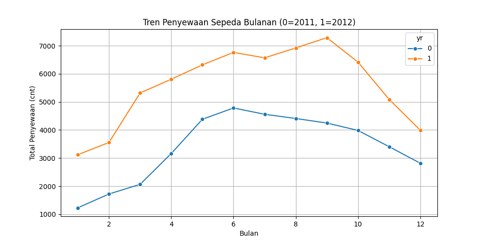
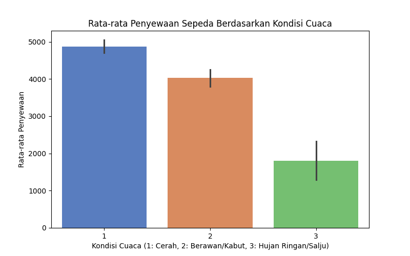
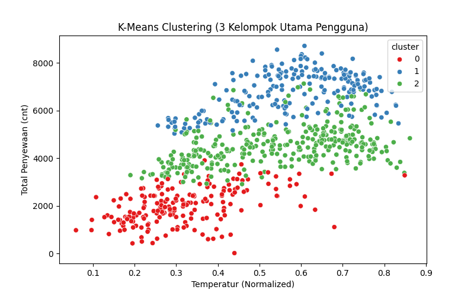
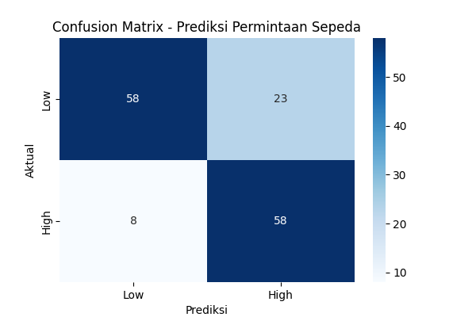

# Bike Rental Business Analytics Report

## 1. Business Problem
Bagaimana mengoptimalkan kapasitas armada rental sepeda dan menyusun strategi promosi yang efisien berdasarkan pola perilaku pelanggan serta variabel cuaca sekitar?

## 2. Dataset
Menggunakan data historis harian (`day.csv`) tahun 2011-2012 yang mencatat volume pengguna kasual, terdaftar, total sewa harian, serta indikator cuaca harian.

## 3. Descriptive Analytics
Berdasarkan visualisasi tren bulanan (`descriptive.png`):
* **Temuan 1:** Terdapat lonjakan pertumbuhan total penyewaan sepeda yang konsisten dan masif dari tahun 2011 ke tahun 2012.
* **Temuan 2:** Permintaan rental sepeda bersifat musiman, memuncak di pertengahan tahun (Musim Panas/Gugur) dan merosot tajam di awal serta akhir tahun (Musim Dingin).
* **Temuan 3:** Pengguna terdaftar (*registered*) berkontribusi jauh lebih dominan terhadap stabilitas bisnis dibandingkan pengguna kasual (*casual*).

## 4. Diagnostic Analytics
Berdasarkan korelasi faktor lingkungan (`diagnostic.png`):
* Kondisi cuaca yang cerah bersahabat berkaitan erat dengan tingginya minat masyarakat untuk menyewa sepeda. Sebaliknya, cuaca buruk atau hujan lebat berbanding lurus dengan penurunan drastis total peminjaman harian karena faktor keselamatan dan kenyamanan pengguna.

## 5. Clustering dan Hidden Pattern
Menggunakan pemodelan K-Means Clustering dengan K=3:
* **Cluster 0 (Low Demand):** Hari dengan suhu dingin/ekstrem dengan rata-rata transaksi paling rendah (~1,991 sewa).
* **Cluster 1 (High Demand):** Hari ideal bersuhu hangat dengan volume peminjaman puncak (~6,781 sewa).
* **Cluster 2 (Medium Demand):** Hari transisi dengan aktivitas peminjaman menengah (~4,534 sewa).
* **Hidden Pattern:** Pengguna kasual cenderung melakukan lonjakan pemesanan impulsif hanya pada hari libur di bawah kondisi Cluster 1 (cuaca sangat mendukung).

## 6. Predictive Analytics
Menggunakan algoritma Decision Tree Classifier untuk memprediksi tingkat permintaan (Low vs High Demand):
* **Hasil Evaluasi:** Model prediksi berhasil mencetak skor tingkat akurasi sebesar 78.91%.
* **Interpretasi:** Melalui struktur confusion matrix, variabel temperatur udara harian merupakan indikator penentu utama (*root node*) yang paling kuat untuk menebak apakah permintaan pasar besok akan melonjak tinggi atau sepi.

## 7. Prescriptive Recommendation
1. **Penambahan Armada Terjadwal:** Menyiapkan unit sepeda cadangan secara maksimal pada hari-hari yang diprediksi masuk kategori *High Demand* (Cluster 1) untuk mengantisipasi lonjakan pengguna kasual.
2. **Manajemen Maintenance Saat Low Demand:** Melakukan perawatan besar-besaran komponen sepeda pada masa *Low Demand* (Musim dingin/hujan) agar tidak mengganggu operasional saat musim puncak.
3. **Kampanye Konversi Pengguna Kasual:** Mengadakan program diskon atau loyalitas khusus akhir pekan untuk merangsang pengguna kasual beralih menjadi member terdaftar (*registered*).

## 8. Conclusion
Penerapan Business Intelligence membuktikan bahwa keputusan manajemen operasional rental sepeda dapat diprediksi dengan akurat (78.91%). Melalui wawasan cluster dan tren ini, perusahaan mampu meminimalkan pengeluaran perawatan di hari sepi dan melipatgandakan keuntungan secara optimal saat cuaca cerah tiba.
